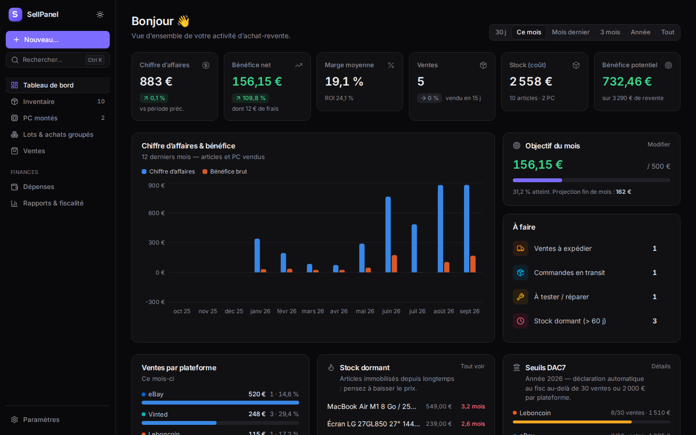
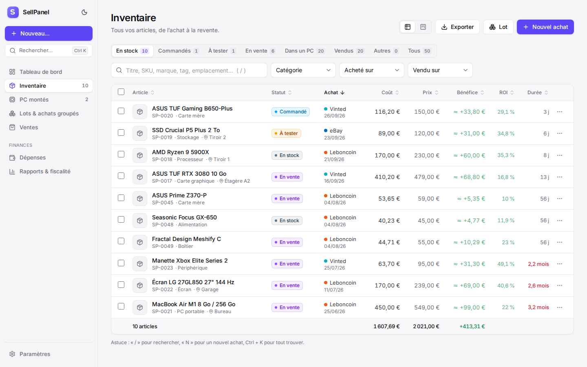
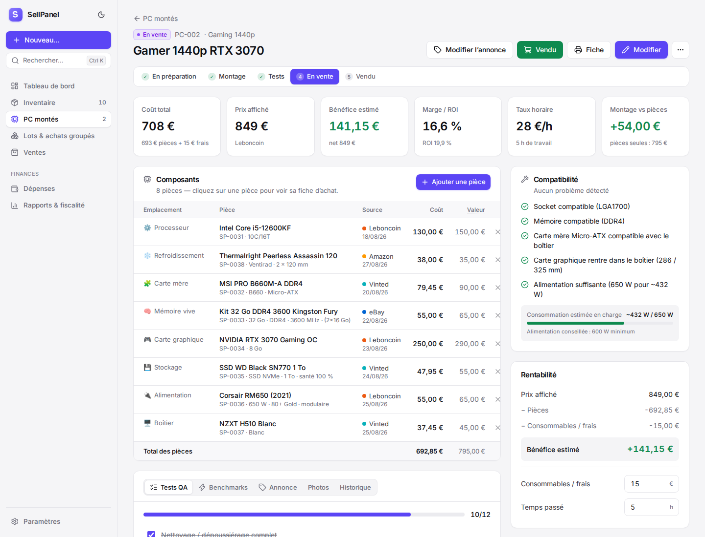

# SellPanel

**Panel web de gestion d’achat-revente** — Vinted, Leboncoin, eBay et toutes les plateformes que vous ajoutez — avec un module complet de **PC montés** : chaque pièce achetée est suivie de l’achat jusqu’à la vente, seule ou intégrée dans un PC.



## Fonctionnalités

### Inventaire & commandes
- Fiche article complète : **plateforme d’achat**, date, **prix payé**, frais de port, **protection acheteur** (calculée automatiquement : Vinted/Leboncoin 5 % + 0,70 €), réparations, vendeur, lien de l’annonce, n° de commande, n° de série, garantie, emplacement de rangement, tags, photos, notes privées.
- Cycle de vie : *Commandé → En stock → À tester → En vente → Réservé → Vendu* (+ Dans un PC, Retourné, Gardé, HS).
- **Coût de revient, bénéfice, marge, ROI et durée de détention** calculés en temps réel ; bénéfice estimé pour le stock non vendu.
- Vue **tableau** (tri, filtres, recherche, sélection multiple, actions groupées) et vue **Kanban** (glisser-déposer entre statuts).
- Actions rapides « Mettre en vente » / « Vendu » avec calcul des frais et du bénéfice avant validation.
- **Aide au prix** : prix plancher (0 € de bénéfice) et prix pour +20 / +35 / +50 % de ROI, frais de la plateforme inclus.
- **Vérifier la cote** : liens de recherche directs (Vinted, Leboncoin, eBay *ventes réussies*, Facebook, Amazon, LeDénicheur).
- Générateur de **texte d’annonce** prêt à coller.
- Historique horodaté de chaque article (statuts, prix, vente, expédition, intégration dans un PC).



### PC montés
- Fiche PC avec **composants par emplacement** (processeur, carte mère, RAM, GPU, stockage, alimentation, boîtier, refroidissement…) ajoutés **depuis le stock** ou saisis directement.
- Depuis la fiche d’un article intégré à un PC, un bandeau renvoie **directement vers la fiche du PC** (coût total, prix, bénéfice).
- **Coût total** (pièces + consommables), **bénéfice**, marge, **taux horaire réel** (temps passé × taux configurable) et **« montage vs pièces »** : le PC monté se vend-il mieux que les pièces séparées ?
- **Contrôles de compatibilité** façon PCPartPicker : socket CPU/carte mère, type de RAM, format carte mère/boîtier, longueur GPU, **puissance d’alimentation** (consommation estimée), partie graphique intégrée, pièces manquantes.
- **Check-list qualité** (stress tests, MemTest, températures, CrystalDiskInfo…), **benchmarks** (Cinebench, 3DMark, FPS en jeu), photos.
- Pipeline visuel *Préparation → Montage → Tests → En vente → Vendu*, démontage en un clic (pièces remises en stock).
- **Annonce générée** (titre + description avec config, performances, contrôles, garantie) et **fiche technique imprimable / PDF** pour l’acheteur.



### Lots & achats groupés
- Achat d’un lot ou d’un **PC complet à démonter** : le coût total est **réparti automatiquement** entre les articles (au prorata de la valeur de revente, à parts égales ou manuellement), au centime près.
- Suivi de la **rentabilisation du lot** (coût récupéré, bénéfice réalisé, bénéfice projeté).

### Finances & fiscalité
- **Tableau de bord** : CA, bénéfice net, marge, ventes, valeur du stock, bénéfice potentiel (avec variation vs période précédente), graphique 12 mois, objectif mensuel avec projection, tâches (à expédier, en transit, à tester, **stock dormant**), âge du stock, meilleures ventes, activité récente.
- **Registre des ventes** (articles + PC) avec suivi des expéditions (n° de suivi).
- **Dépenses** générales (emballages, carburant, outillage, boosts…) déduites du bénéfice net.
- **Rapports** : compte de résultat mensuel, performance par plateforme de vente, **meilleures sources d’achat** (ROI, taux d’écoulement), ventes par catégorie.
- **Seuils DAC7** par plateforme (30 ventes ou 2 000 € / an) avec alertes.
- **Micro-entreprise** : estimation des cotisations URSSAF par trimestre (taux configurable, 12,3 % en 2026 pour l’achat-revente).
- **Exports CSV** (Excel FR) : livre des recettes, registre des achats, inventaire. **Import CSV** depuis votre tableur.

### Confort
- Palette de commandes **Ctrl + K** (recherche globale et actions), raccourcis `N` (nouvel achat) et `/` (recherche).
- Thème clair / sombre, interface responsive (utilisable sur téléphone).
- Plateformes et catégories personnalisables, frais configurables, préfixes de SKU.
- Sauvegarde / restauration JSON complète, données de démonstration, protection par mot de passe.

## Démarrage rapide

Prérequis : **Node.js 22.13 ou plus récent** (la base SQLite utilise le module natif `node:sqlite`, aucune compilation nécessaire).

```bash
npm install
npm run build
npm start
```

Ouvrez **http://localhost:3000**. Sur une base vide, le tableau de bord propose de charger des **données de démonstration**.

### Développement

```bash
npm run dev        # API (port 3000) + interface Vite avec rechargement à chaud (http://localhost:5173)
npm test           # tests unitaires et d’API
npm run typecheck  # vérification TypeScript
npm run format     # formatage Prettier
```

### Docker

```bash
APP_PASSWORD=mon-mot-de-passe docker compose up -d --build
```

Les données (base `sellpanel.db` + photos) sont stockées dans `./data`.

## Configuration

Variables d’environnement (ou fichier `.env` à la racine, voir `.env.example`) :

| Variable | Défaut | Rôle |
| --- | --- | --- |
| `PORT` | `3000` | Port HTTP |
| `DATA_DIR` | `./data` | Dossier de la base SQLite et des photos |
| `APP_PASSWORD` | *(vide)* | Active l’écran de connexion (session de 30 jours). **À définir avant toute exposition sur Internet.** |
| `HOST` | `0.0.0.0` | Interface d’écoute |

Tout le reste (plateformes et leurs frais, catégories, objectif mensuel, taux horaire, seuil de stock dormant, garantie par défaut, micro-entreprise, seuils DAC7) se règle dans **Paramètres**.

## Sauvegardes

- **Paramètres → Données → Télécharger la sauvegarde** : export JSON complet, restaurable en un clic.
- Les photos sont dans `data/uploads` : sauvegardez le dossier `data/` entier pour tout conserver.

## Architecture

```
server/   API REST Express 5 + SQLite (node:sqlite), validation zod, photos, authentification
shared/   logique métier commune : types, calculs de marge, analytics, compatibilité PC, annonces
src/      interface React 19 + Vite + Tailwind CSS 4, TanStack Query, Recharts, Radix UI
tests/    tests (node:test) des calculs et de l’API
```

Les calculs (bénéfice, ROI, répartition des lots, DAC7…) sont centralisés dans `shared/` et utilisés à la fois par le serveur et l’interface.

## Inspirations

Fonctionnalités inspirées des logiciels professionnels de revente — **Flipwise** (profit par article, stock dormant 90/180/365 j), **My Reseller Genie** (compte de résultat, dépenses, rapports fiscaux), **Vendoo / List Perfectly** (multi-plateformes, statuts d’annonce), **Rig Flip / BuildFlipper** (revente de PC : pièces, montage, main-d’œuvre, démontage en un clic) et **PCPartPicker** (compatibilité) — adaptées au contexte français (Vinted, Leboncoin, DAC7, micro-entreprise).

> Les grilles de frais pré-remplies correspondent aux conditions 2026 pour un vendeur particulier (protection acheteur Vinted/Leboncoin, eBay gratuit pour les particuliers depuis le 1er septembre 2026). Vérifiez-les et ajustez-les selon votre statut dans Paramètres → Plateformes.
